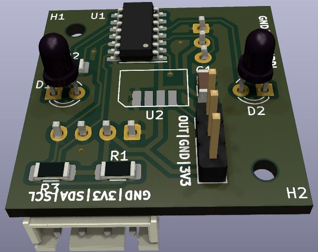

# Universal IR optical, directional proximity detector/counter with TWI (I²C) interface

_*Disclaimer:* This is not an officially supported Google product._



The board uses two IR LEDs with a modulated signal (both either 38KHz or 56KHz,
depending on the receiver type) whose light reflects off objects in front of
the device into an IR receiver.

Using two LEDs allows to determine an approximate position (or direction of
movement) of an object in one dimension. Modulating the signal significantly
reduces interference from natural IR light sources.

The microcontroller
([ATtiny3224](https://www.microchip.com/en-us/product/attiny3224)) varies the
signal strength to compute the strength of the reflected signal using the
[binary search
algorithm](https://en.wikipedia.org/wiki/Binary_search_algorithm).

The measured values are made available through I²C (subordinate).

## Event counter

In addition to reporting current values of reflections from both LEDs, the
microcontroller also counts the number of times the reflection quickly changes
(which we call "events"). These events are defined using two parameters:

- [Exponential moving
  average](https://en.wikipedia.org/wiki/Exponential_smoothing) smoothing
  factor ("half-life"), which computes the baseline signal to compare against.
  The default value is half-life of 10s.
- Delta factor \[0..1\]. An event is triggered when the signal differs more
  than the delta factor from its exponential moving average.

There are the following event types that are counted independently:

1. Signal reflected from LED1 crosses the delta boundary and returns while
   LED2's signal remained within.
   ```
   LED1:  ___|‾‾‾|___
   LED2:  ___________
   ```
2. Similarly the other way around.
3. LED1's signal crossed outside the delta boundary followed by LED2's signal
   crossing outside. This captures the situation when an object is moving in
   the direction LED1->LED2.
   ```
   LED1:  __|‾‾‾|____
   LED2:  ____|‾‾‾|__
   ```
4. Similarly the other way around.

## Status

Development of a prototype.

## Contributions

Please see [Code of Conduct](docs/code-of-conduct.md) and [Contributing](docs/contributing.md).
